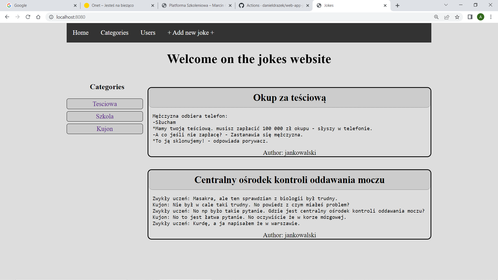
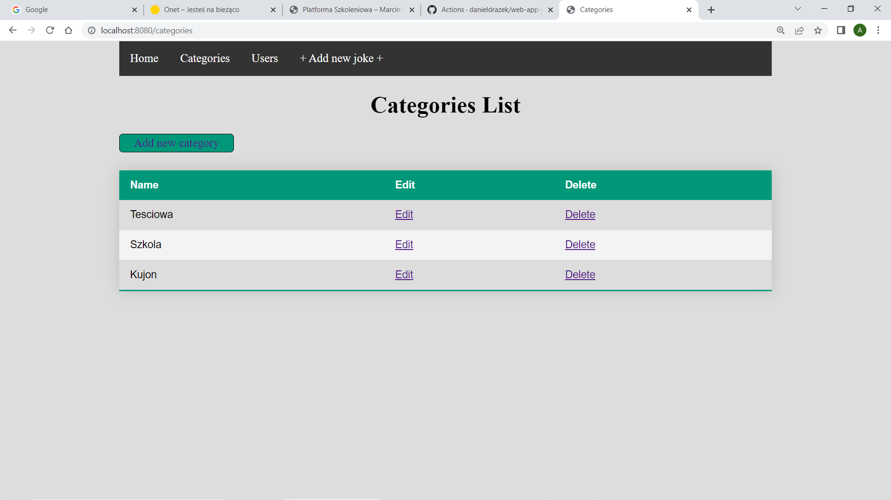
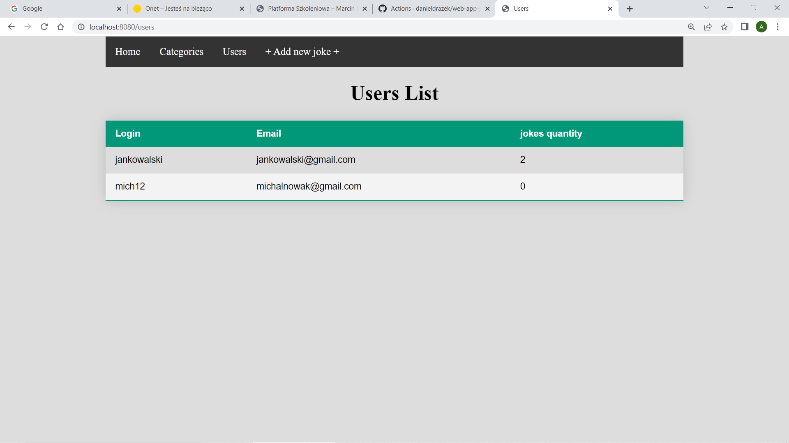
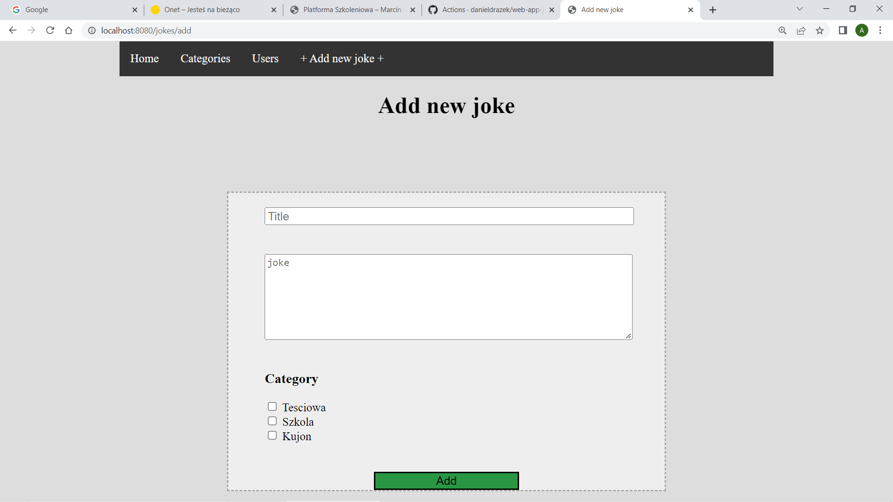
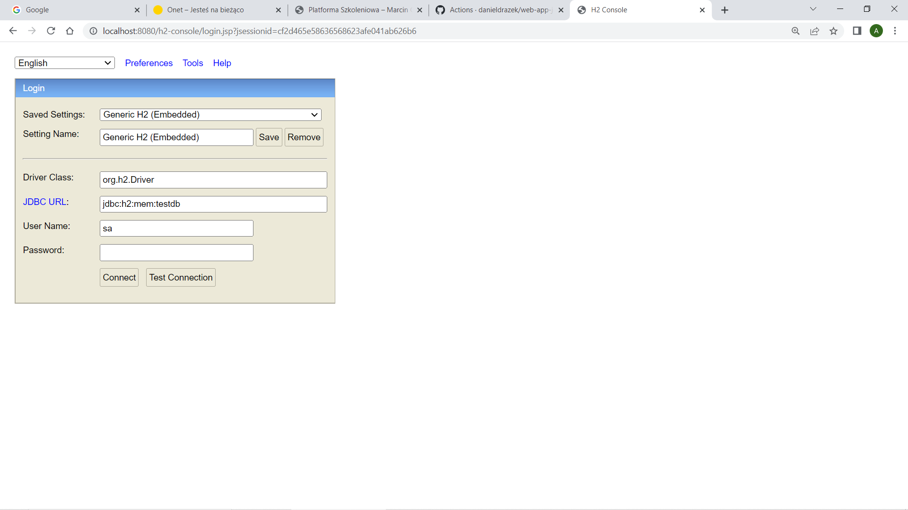
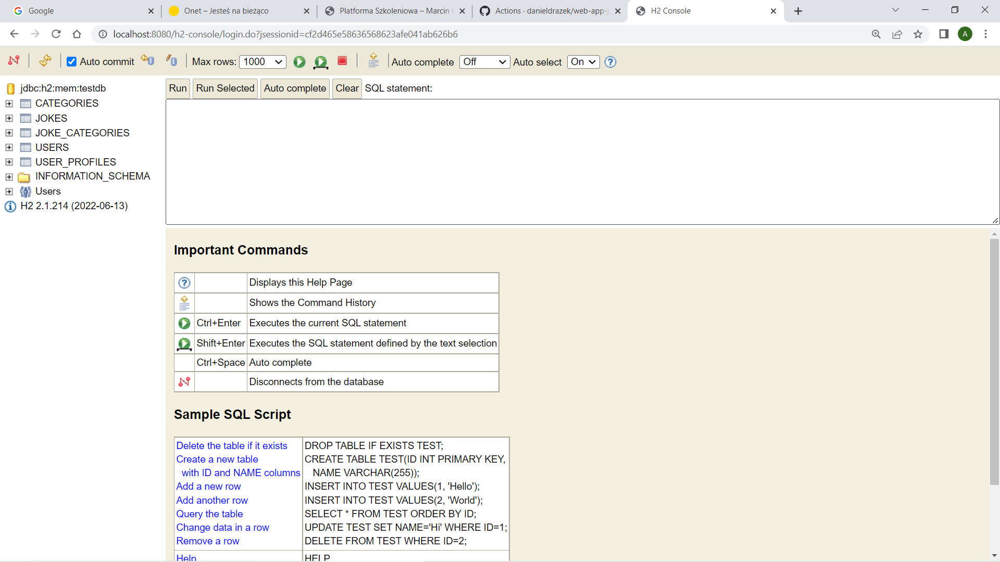

# Jokes Web App

## General Information
This web app jokes data management is made in is Spring framework technology. The app has a web interface linked to jokes H2 database. The application is based on CRUD (Create, Read, Update, and Delete) standard and built on the basis of the REST API architecture. The application uses the MVC (Model - View - Controller) design pattern.

## Screenshots
### Home website

### Category list table website

### Users list table website

### Add new joke form website

### H2 database login window website

### H2 database view window website

## Technologies Used
- Java version 17.0.2 (back end)
- Spring framework
- Spring boot
- Spring web
- Spring data
- H2 database
- Hibernate framework (as an implementation of JPA)
- XML (front end)
- CSS (front end)
- Maven
- REST API
- GSON library
- Postman (testing REST API)

## Design patterns:
- MVC (Model, View, Controller)
- JPA (Java Persistence API)
- CRUD (Create, Read, Update, Delete)
- REST API

## Features
- creating a joke in web app / database
- adding a joke in web app / database
- modification of a joke in web app / database
- editing a joke in web app / database
- removing a joke in web app / database
- menu bar
- Add new category button
- Add new joke button
- Add new joke form
- Users List
- Category List
- Edit link
- Delete link
- jokes H2 database connected to web app

## Usage
Run:
- Java version 17.0.2
- Postman app
- http://localhost:8080/ (web app)
- http://localhost:8080/h2-console (db)

## Room for Improvement
- Managing of students at school/university
- web restaurant
- web shop
- social networking site (e.g. Facebook)